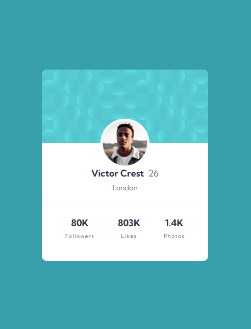

# 📌 Profile Card Component

## 📝 Descripción
Este proyecto es un reto de **Frontend Mentor** que consiste en construir una tarjeta de perfil responsiva usando **HTML5** y **Tailwind CSS**.  
El objetivo principal fue practicar la maquetación, la organización de estilos con `@layer components` y la personalización del tema con `@theme` para colores y tipografías.

---

## 📸 Capturas de pantalla

### 📱 Vista Mobile
*(No disponible en carpeta)*

### 💻 Vista Desktop

---

## 🛠 Tecnologías utilizadas
- HTML5
- Tailwind CSS v4
- Google Fonts (Kumbh Sans)

---

## 🚀 Retos
- Configurar **Tailwind CSS v4** para personalizar colores y tipografías.
- Crear presets tipográficos reutilizables con `@apply`.
- Manejar imágenes y fondos con `bg-[url()]` en Tailwind.

---

## 📚 Aprendizajes
- Cómo usar `@layer components` para crear clases personalizadas y reutilizables.
- Definir variables de tema en Tailwind con `@theme`.
- Aplicar `aspect-ratio` y `bg-cover` para manejar fondos responsivos.

---

## 👨‍💻 Autor
**AnguiNator**  

